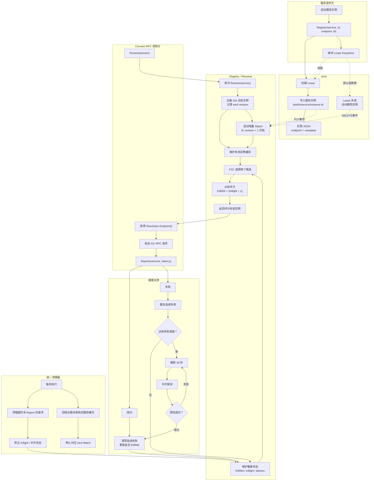

# 服务注册、发现与负载均衡流程

## 逻辑概览

1. 服务启动后申请 etcd Lease，写入实例信息并持续 KeepAlive；服务停止后 Lease 到期，实例自动删除。
2. Resolver 首次解析服务时执行全量 Get，随后从查询 revision 的下一版本开始增量 Watch。
3. 每次请求通过 P2C 抽取两个健康实例，使用 `EWMA × (inflight + 1)` 评分并选择较低者。
4. 调用方通过 `Report` 回传请求结果和延迟，用于更新 EWMA、连续失败数、摘除及半开状态。
5. Janitor 统一清理超时未 Report 的请求，并回收长期未使用的服务缓存及 Watch。
